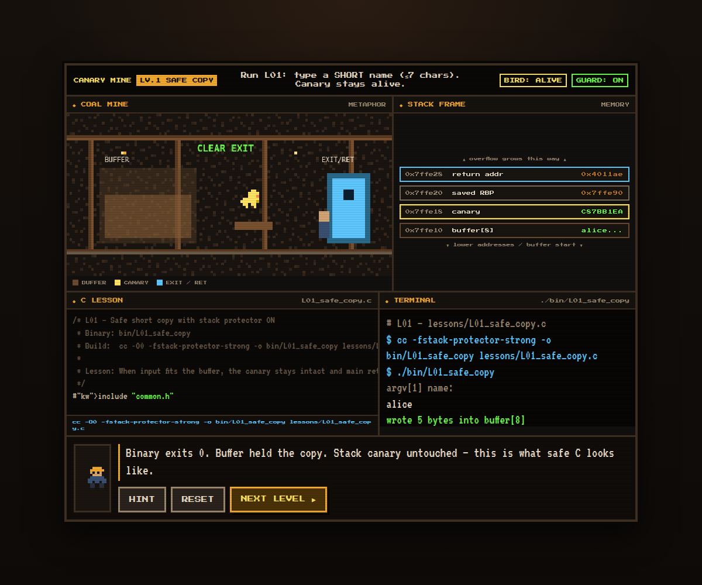

# CANARY MINE

<p align="center">
  <strong>An 8-bit expedition into stack canaries and safe C</strong><br />
  Twelve interactive lessons · real lesson binaries · mine metaphor → memory → code → terminal
</p>

<p align="center">
  
</p>

<p align="center">
  <em>Buffer → canary → return address — taught as a coal mine, a stack frame, and real C.</em>
</p>

---

## What this is

**CANARY MINE** is an educational playground for stack canaries and everyday C memory-safety mistakes. You play an 8-bit mine shaft where toxic gas is an overflow, the yellow bird is the canary, and the exit door is the return address — while a live stack diagram, the actual lesson source, and a terminal stay in sync.

The same material ships as real, compilable binaries under `bin/` so you can reinforce each level outside the browser.

## Features

- **12 progressive levels** from safe copy through hardening flags
- **Four synced views:** coal mine · stack frame · C lesson · terminal
- **Real C sources** in `lessons/` with matching `make` targets
- **libcanary** teaching library for a manual derived-canary lesson
- Zero-build web game (`make game`) plus optional native binaries (`make lessons`)

## Quick start

```bash
make all          # build lesson binaries + bundle C sources into the game
make game         # serve the game at http://localhost:8080
```

Open [http://localhost:8080](http://localhost:8080), press **START**, and type into the terminal as each level instructs.

### Run lesson binaries directly

```bash
./bin/L01_safe_copy alice
./bin/L02_strcpy_overflow AAAAAAAAAAAA    # expect: stack smashing detected
./bin/L07_guard_off AAAA                  # protector intentionally OFF
printf 'bob\n' | ./bin/L11_safe_fgets
make test-lessons                         # smoke-test key binaries
```

## Curriculum

| Level | Binary | Topic |
|------:|--------|-------|
| 1 | [`L01_safe_copy`](lessons/L01_safe_copy.c) | Bounded `strncpy`, stack protector ON |
| 2 | [`L02_strcpy_overflow`](lessons/L02_strcpy_overflow.c) | Unbounded `strcpy` → canary smash |
| 3 | [`L03_stack_layout`](lessons/L03_stack_layout.c) | Buffer → canary → saved RBP → return address |
| 4 | [`L04_gets_banned`](lessons/L04_gets_banned.c) | Why unbounded reads / `gets` are indefensible |
| 5 | [`L05_size_mismatch`](lessons/L05_size_mismatch.c) | Tiny destination, oversized source |
| 6 | [`L06_epilogue_check`](lessons/L06_epilogue_check.c) | Function epilogue / `__stack_chk_fail` |
| 7 | [`L07_guard_off`](lessons/L07_guard_off.c) | `-fno-stack-protector` and silent hijack |
| 8 | [`L08_off_by_one`](lessons/L08_off_by_one.c) | Off-by-one writes past the buffer |
| 9 | [`L09_strncpy_pitfall`](lessons/L09_strncpy_pitfall.c) | `strncpy` without a forced NUL |
| 10 | [`L10_libcanary`](lessons/L10_libcanary.c) | Manual derived canary via `libcanary` |
| 11 | [`L11_safe_fgets`](lessons/L11_safe_fgets.c) | Defender pattern: `fgets` + `snprintf` |
| 12 | [`L12_hardening`](lessons/L12_hardening.c) | `-fstack-protector-strong` + `_FORTIFY_SOURCE` |

Lesson sources live in [`lessons/`](lessons/). The game embeds them in the **C LESSON** panel through `make bundle` → [`game/lesson_bundle.js`](game/lesson_bundle.js).

## How the game teaches

| Panel | Role |
|-------|------|
| **Coal mine** | Metaphor: buffer work zone, yellow canary, EXIT / return address |
| **Stack frame** | Same layout as memory slots, with overflow growing upward |
| **C lesson** | Exact source for the level plus its compile line |
| **Terminal** | Type input as if invoking `./bin/LXX_...` |

Safe input keeps the bird alive. Overflow turns into “toxic gas,” trips the canary, and aborts before the exit is hijacked — unless you intentionally disable the guard.

## Repository layout

```text
├── game/              # CANARY MINE web experience
├── lessons/           # Twelve C lesson sources
├── libcanary/         # Teaching canary plant / check / fail API
├── bin/               # Built lesson binaries (via make lessons)
├── docs/images/       # README screenshots
├── tools/             # Source bundler for the game
└── Makefile
```

## Build targets

| Target | Description |
|--------|-------------|
| `make all` | Build binaries and regenerate `game/lesson_bundle.js` |
| `make lessons` | Compile `bin/L01` … `bin/L12` |
| `make bundle` | Embed lesson sources for the web UI |
| `make game` | Serve the game on port 8080 |
| `make test-lessons` | Smoke-test representative binaries |
| `make clean` | Remove `bin/` and the generated bundle |

## Takeaways

- Bound every copy — never rely on a canary alone to fix `gets` / `strcpy`
- The canary sits between the buffer and the saved return address
- On mismatch at function epilogue, abort before control-flow hijack
- Ship with `-fstack-protector-strong`, `_FORTIFY_SOURCE`, and safe APIs

## License

Educational project. Use and adapt for teaching stack canaries and C memory safety.
